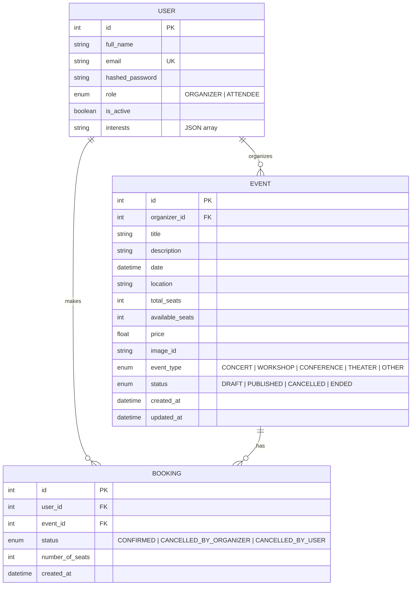

# Database Schema Documentation

This document describes the SQL schema and entity relationships for the Event Management System.

## Entity Relationship Diagram

---

## Tables

### 1. `users`

Stores user account information for both organizers and attendees.

| Column            | Type           | Constraints              | Description                          |
|-------------------|----------------|--------------------------|--------------------------------------|
| `id`              | `INTEGER`      | PRIMARY KEY, AUTO_INCREMENT | Unique user identifier            |
| `full_name`       | `VARCHAR(255)` | INDEXED                  | User's full name                     |
| `email`           | `VARCHAR(255)` | UNIQUE, NOT NULL, INDEXED| User's email address                 |
| `hashed_password` | `VARCHAR(255)` | NOT NULL                 | Bcrypt hashed password               |
| `role`            | `ENUM`         | NOT NULL, DEFAULT 'ATTENDEE' | `ORGANIZER` or `ATTENDEE`        |
| `is_active`       | `BOOLEAN`      | DEFAULT TRUE             | Account status                       |
| `interests`       | `VARCHAR(500)` | DEFAULT '[]'             | JSON array of user interests         |
| `profile_image_id`| `VARCHAR(255)` | NULLABLE                 | Reference to profile image           |

---

### 2. `events`

Stores event information created by organizers.

| Column            | Type           | Constraints              | Description                          |
|-------------------|----------------|--------------------------|--------------------------------------|
| `id`              | `INTEGER`      | PRIMARY KEY, AUTO_INCREMENT | Unique event identifier           |
| `organizer_id`    | `INTEGER`      | FOREIGN KEY → `users.id` | Event creator                        |
| `title`           | `VARCHAR(255)` | INDEXED                  | Event title                          |
| `description`     | `VARCHAR(1000)`| NULLABLE                 | Event description                    |
| `date`            | `DATETIME`     |                          | Event start date and time            |
| `end_date`        | `DATETIME`     | NULLABLE                 | Event end date and time              |
| `location`        | `VARCHAR(255)` |                          | Event venue                          |
| `total_seats`     | `INTEGER`      |                          | Total capacity                       |
| `available_seats` | `INTEGER`      |                          | Remaining seats                      |
| `price`           | `FLOAT`        |                          | Ticket price                         |
| `image_id`        | `VARCHAR(255)` | NULLABLE                 | Reference to event image (Filename OR full URL) |
| `event_type`      | `ENUM`         | NOT NULL, DEFAULT 'OTHER'| `CONCERT`, `WORKSHOP`, `CONFERENCE`, `THEATER`, `OTHER` |
| `status`          | `ENUM`         | DEFAULT 'DRAFT'          | `DRAFT`, `PUBLISHED`, `CANCELLED`, `ENDED` |
| `created_at`      | `DATETIME`     | DEFAULT CURRENT_TIMESTAMP| Creation timestamp                   |
| `updated_at`      | `DATETIME`     | AUTO UPDATE              | Last modification timestamp          |

---

### 3. `bookings`

Stores booking/reservation records linking users to events.

| Column            | Type           | Constraints              | Description                          |
|-------------------|----------------|--------------------------|--------------------------------------|
| `id`              | `INTEGER`      | PRIMARY KEY, AUTO_INCREMENT | Unique booking identifier         |
| `user_id`         | `INTEGER`      | FOREIGN KEY → `users.id`, NOT NULL | Booking user               |
| `event_id`        | `INTEGER`      | FOREIGN KEY → `events.id`, NOT NULL | Booked event              |
| `status`          | `ENUM`         | NOT NULL, DEFAULT 'CONFIRMED' | `CONFIRMED`, `CANCELLED_BY_ORGANIZER`, `CANCELLED_BY_USER` |
| `number_of_seats` | `INTEGER`      | NOT NULL, DEFAULT 1      | Number of seats booked               |
| `created_at`      | `DATETIME`     | DEFAULT CURRENT_TIMESTAMP| Booking timestamp                    |

---

## Relationships

| Relationship       | Type        | Description                                           |
|--------------------|-------------|-------------------------------------------------------|
| User → Event       | One-to-Many | An organizer can create multiple events               |
| User → Booking     | One-to-Many | A user can have multiple bookings                     |
| Event → Booking    | One-to-Many | An event can have multiple bookings                   |

---

## Enums

### UserRole
- `ORGANIZER` – Can create and manage events
- `ATTENDEE` – Can browse and book events

### EventStatus
- `DRAFT` – Event not yet published
- `PUBLISHED` – Event is live and bookable
- `CANCELLED` – Event has been cancelled
- `ENDED` – Event has concluded

### EventType
- `CONCERT`
- `WORKSHOP`
- `CONFERENCE`
- `THEATER`
- `OTHER`

### BookingStatus
- `CONFIRMED` – Active booking
- `CANCELLED_BY_ORGANIZER` – Cancelled by event organizer
- `CANCELLED_BY_USER` – Cancelled by the attendee
